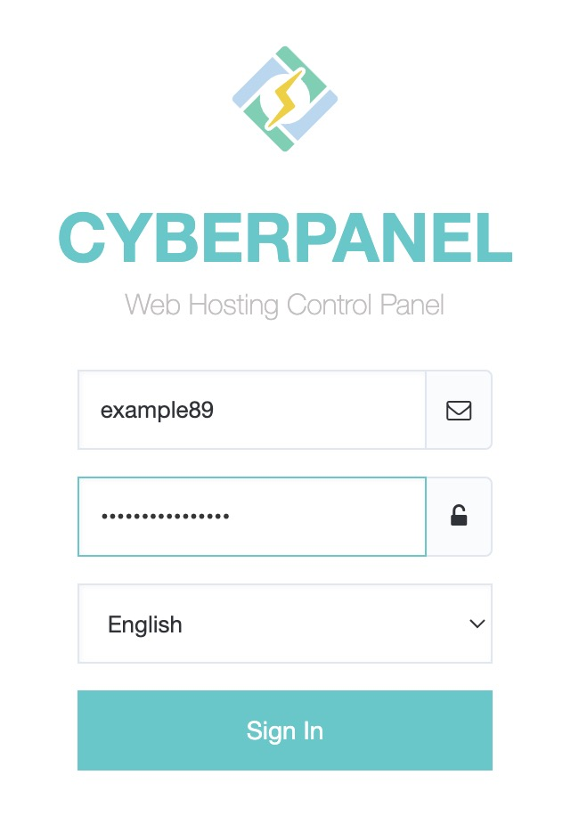
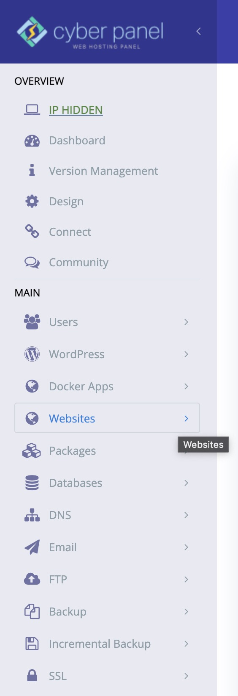
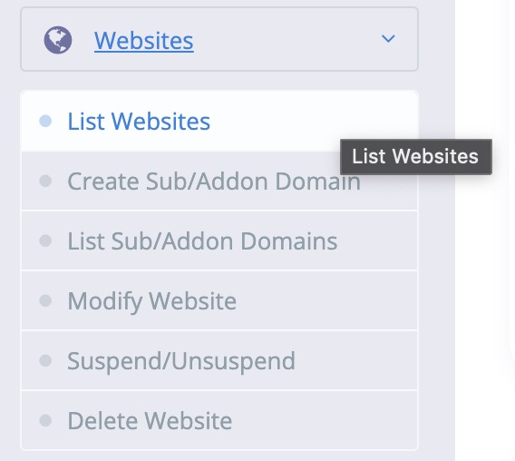
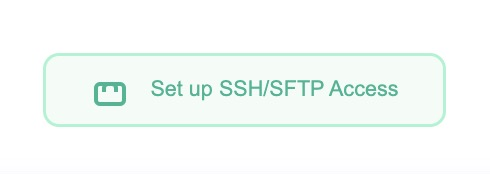

# Cyber Panel Setup

## SSH / SFTP Access setup

> [!NOTE]
> All the following is using generic names including the domain name, the user and ssh/sftp user name (we don't want to invite hackers to our site...)
> Make sure you are using the domain **specific to your year**.

First, visit your domain where your site is hosted

