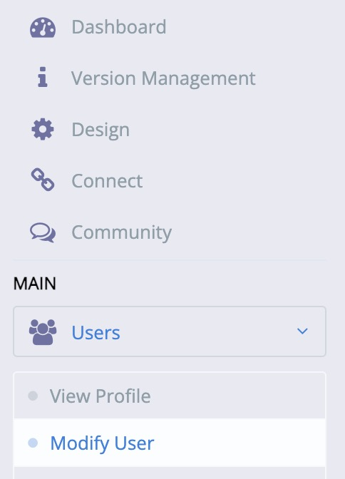
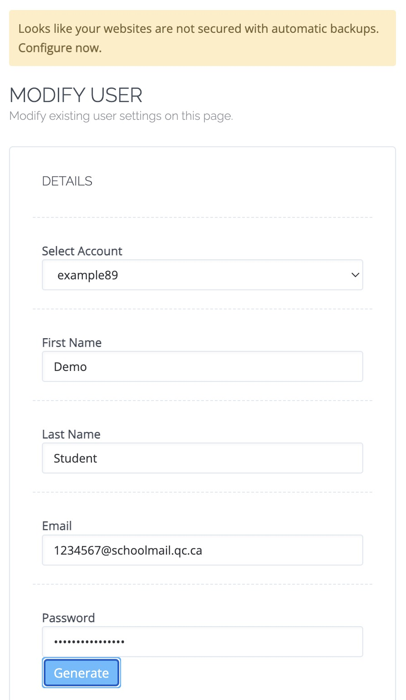

# Change Cyber Panel Password

First log in to Cyber Panel, if you forgot how to do it, follow the [sftp setup guide here](sftp-setup.md).

Once you are logged in, open the `Users` tab abd click on `Modify User`.

You can now enter a new password for accessing Cyber Panel.

> [!NOTE]
> This is only to access Cyber Panel, for accessing your files with vscode, you need to change your ssh/sftp password, [follow the guide here](sftp-setup.md).

