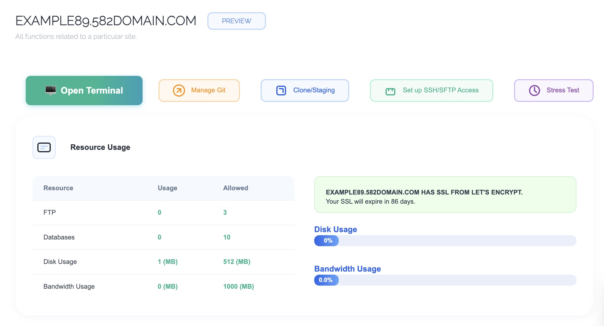

# SSH / SFTP Access setup

> [!NOTE]
> All the following is using generic names including the domain name, the user and ssh/sftp user name (we don't want to invite hackers to our site...)
> Make sure you are using the domain **specific to your year**.

First, visit your domain where your site is hosted, in our example here, we're on 582domain.com, make sure you are on the **right one for your year** and press `Enter`.

Once you arrive to the Cyber Panel, log in with the details for your personal subdomain. In this example, the student's link and account is `example89`.

> [!NOTE]
> If you forgot your password, you will have to see a teacher to reset it with them.

Once you are logged in, go to the left side of the panel and look for the `Websites` tab and click on it.

Once the `Websites` tab open, you should see a list of websites management options, click on the `List Websites` option.

You will now see your own website subdomain name open.

Click on `Manage` on the right side of the page.

Once you arrive on the manage page, you will see a list of options at the top.

Click on `Set up SSH/SFTP Access`.

The last step to enter a password for your default SSH user.

> [!IMPORTANT]
> The user name for SSH/SFTP is **NOT** the same as your Cyber Panel, so make sure you **take note of this user** for setting up your sftp access in vscode.

