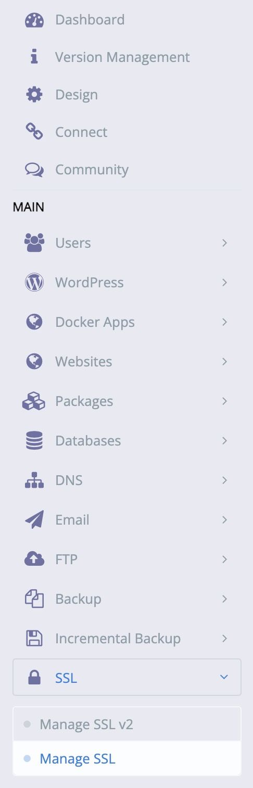
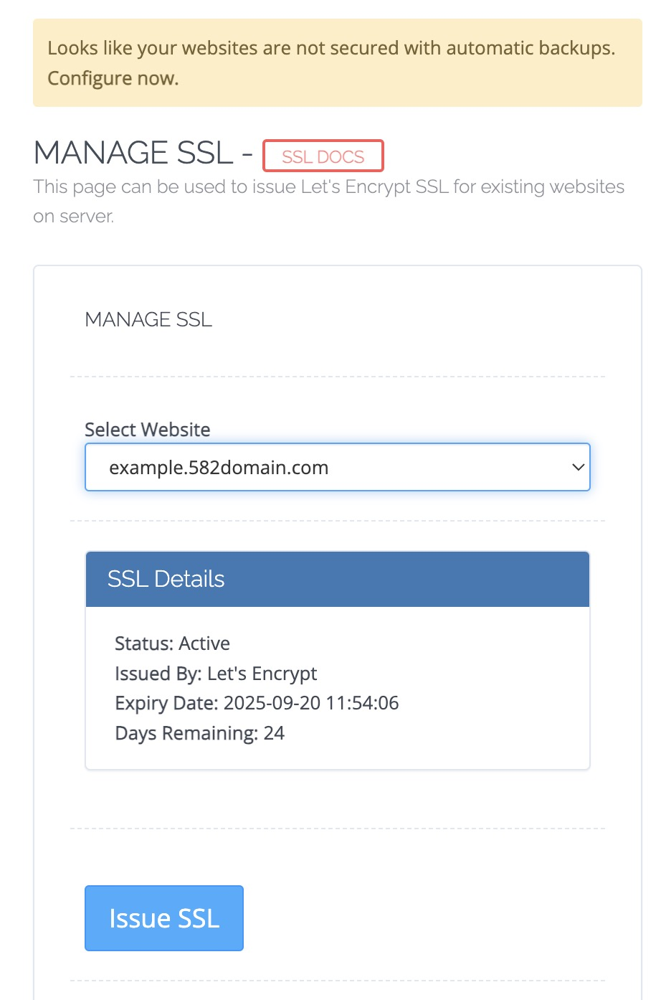

# Issue a SSL certificate

First log in to Cyber Panel, if you forgot how to do it, follow the [sftp setup guide here](sftp-setup.md).

Once you are logged in, open the `SSL` tab abd click on `Manage SSL`.

Once you are in MANAGE SSL, Select your Website and press on `Issue SSL` to issue a SSL certificate for your website.

